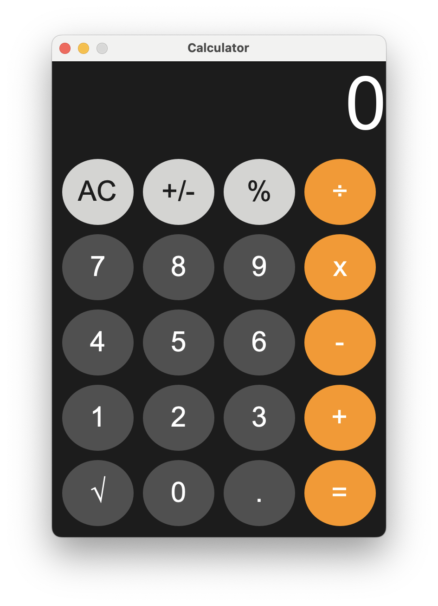

# Swing Calculator

A simple calculator application built in Java Swing, inspired by Apple's calculator.



---
## Features

- Basic arithmetic: addition, subtraction, multiplication, division
- Percentage, sign toggle (+/-), and square root functions
- Rounded buttons with clean UI
- Decimal number support

---
## Installation

1. Clone the repository:
   ```bash
   git clone https://github.com/parfenon/swing-calculator.git
   ```
2. Compile the project (adjust paths as needed):
   ```bash
   javac -d out src/main/java/parfenix/code/app/*.java
   ```
3. Run the application:
   ```bash
   java -cp out parfenix.code.app.Main
   ```
   
## Technologies
- Java Swing for GUI development
- Java 21
- Gradle